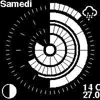
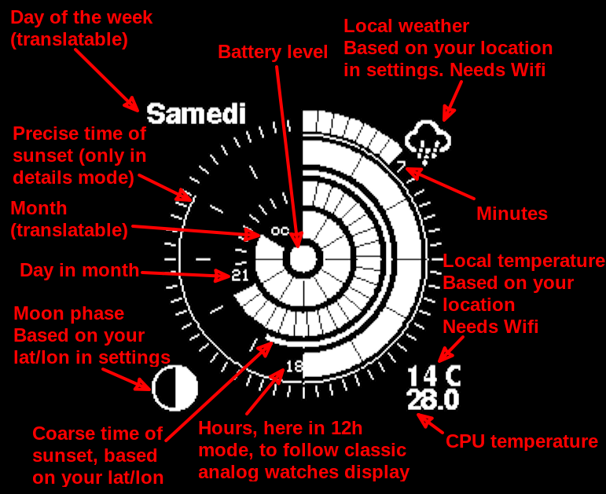

# Orbital watch face
A watchface showing the time and date in circles

## Origin
First and foremost, this watch face is an evolution of another watch face, https://github.com/Sudrien/watchy_orbital.

But its necessity to use a custom build of the Watchy lib irked me, and I wanted to add a few features.

## Features
* Display in circles the minute, hour, day of month, month
* The center circle is the battery level
* Thin circles display when are the sunrise and sunset
* Top left displays the day of week
* Bottom left shows the phase of the moon
* Top right display the weather in your location (based on your settings), only if Wifi is enabled, configured, and available
* Bottom right shows the weather temperature, if Wifi is enabled, configured and available. Show also the internal temperature of the watch
* Black/White theme : alternate between those modes by using up and down buttons
* 24h/12h mode
* Details mode. Display tiny text showing the values of important circles

8 Modes :

1. white on black, no details, 12h
2. white on black, no details, 24h
3. white on black, details, 12h
4. white on black, details, 24h
5. black on white, no details, 12h
6. black on white, no details, 24h
7. black on white, details, 12h
8. black on white, details, 24h

See the below screenshot for an explanation of everything on the watchface (the mode used in this screenshot is the third)

## How to use/install
### Settings
First, you have to edit the `settings.h` to set your… settings.  
You have a couple more settings to set by editing the watchface specific settings in `watchy_orbital_settings.h`. The latitude/longitude of your location, the translation of the name of the days of the week, and a short code for the months, and a couple more specific settings to fit all watches.

### Compilation
I used PlatformIO.  
You can use `pio run -t upload` to compile and upload the project to your Watchy.

If you don't use PlatformIO, look at the `platformio.ini` to have a list of libs necessary for compilation.
